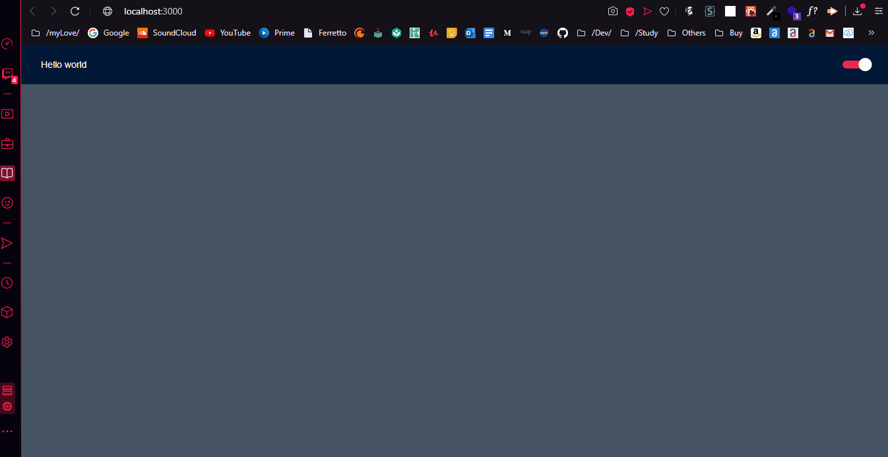

<meta charset="utf-8">
<h1 align="center">
    
</h1>

<h4 align="center">
  ThemeSwitcher
</h4>

 

  

<!--  -->
  
  
  

  <a href="#rocket-technology">Technology</a>&nbsp;&nbsp;&nbsp;|&nbsp;&nbsp;&nbsp;
  <a href="#-project">Project</a>&nbsp;&nbsp;&nbsp;|&nbsp;&nbsp;&nbsp;
  <a href="#-layout">Layout</a>&nbsp;&nbsp;&nbsp;|&nbsp;&nbsp;&nbsp;
  <a href="#-how-to-contribute">How to contribute</a>&nbsp;&nbsp;&nbsp;|&nbsp;&nbsp;&nbsp;
  <a href="#memo-license">License</a>

 

<!-- 

  

 -->

## :rocket: Technology

This project was developed with the following technologies:

- [React](https://reactjs.org)
- [TypeScript](https://www.typescriptlang.org)

## 💻 Project

The ThemeSwitcher is a project to pratice the creation of darkmode using React.Js and Typescript.

## 🔖 Layout
<a href="#gif">Darkmode</a>

## ♻️ How to contribute

- Fork this repository;
- Create a branch with your feature: `git checkout -b my-feature`;
- Commit your changes: `git commit -m 'feat: My new feature'`;
- Push to your branch: `git push origin minha-feature`.

After the merge of your pull request is done, you can delete your branch.

<!-- ## :memo: License

This project is under the MIT license. See the [LICENSE](LICENSE.md) file for more details. -->

---

Made with ♥ and ☕  by <strong><a href="https://www.linkedin.com/in/joão-bispo-2077/">João Bispo</a> 😎</strong> 
